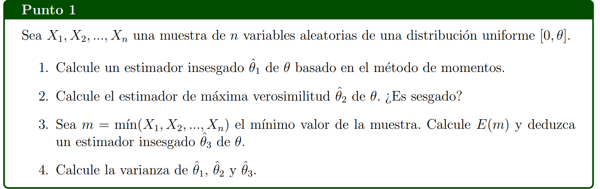
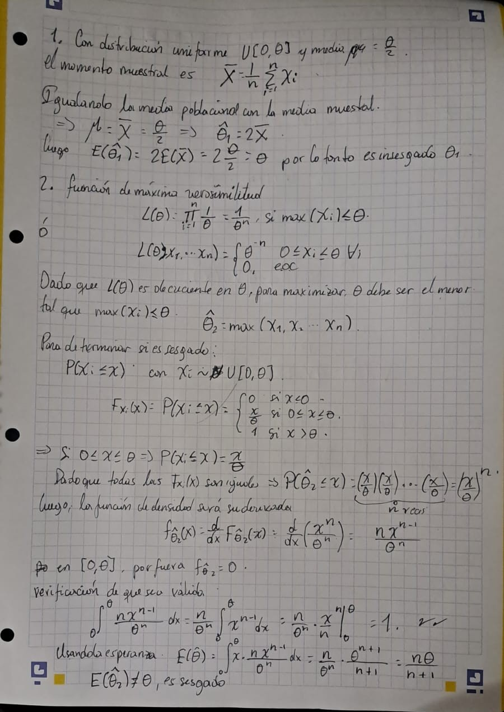
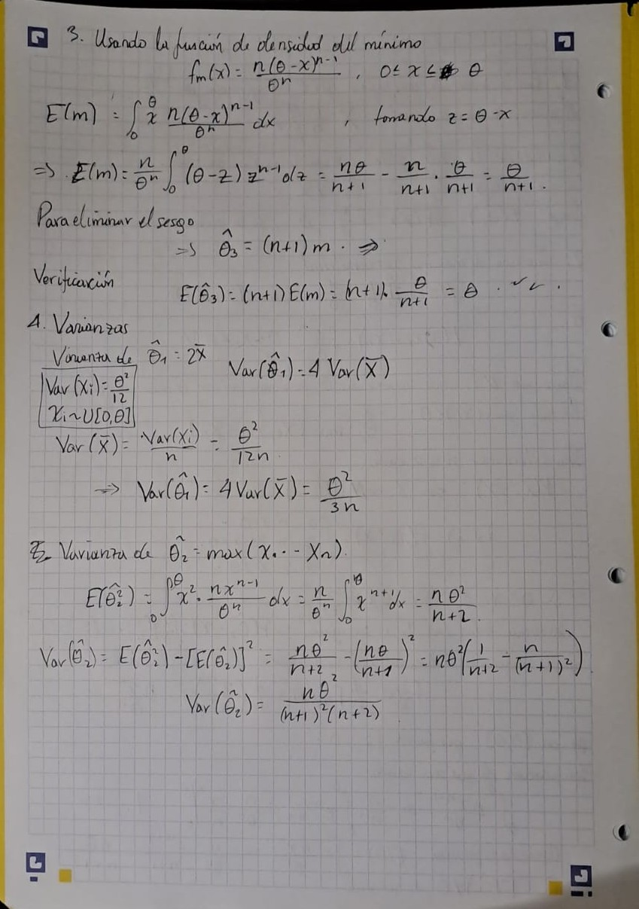
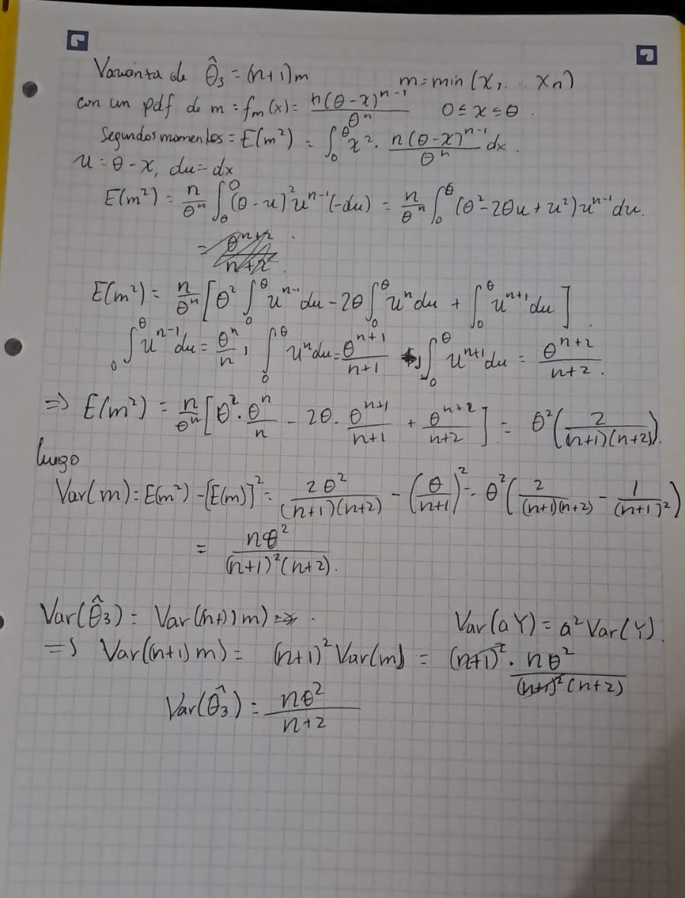
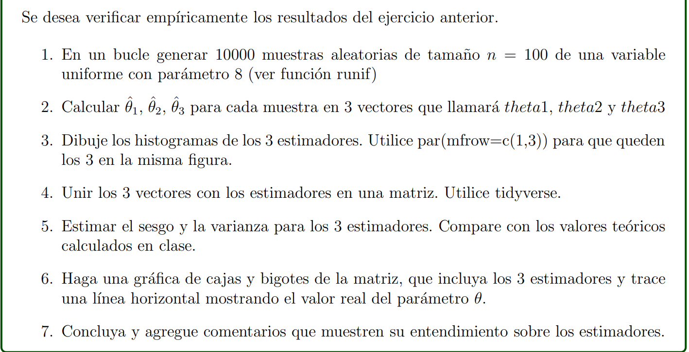

# Punto 1









# Punto 2



### 2.1 - Generación de Muestras

```{r}
set.seed(42)
n <- 100   # Tamaño de muestra
M <- 1000  # Número de muestras
theta <- 8 # Parámetro verdadero

# Generación de muestras uniformes
muestras <- matrix(runif(M*n, 0, theta), nrow = M, ncol = n)

# Visualización de una muestra aleatoria
hist(muestras[1, ], breaks = 15, col = "#4E79A7", 
     main = "Distribución de una Muestra Uniforme",
     xlab = "Valores", ylab = "Frecuencia",
     border = "white")


```

### 2.2 - Cálculo de Estimadores

```{r}
#Los vectores tendrán tamaño 1000 (pues hay 1000 muestras)
#FÓRMULAS
#estimador1 = 2*x_bar
#estimador2 = max(x_1 , x_2, ... , x_n)
#estimador3 = (n + 1) * min(x_1, x_2 , ..., x_n)
set.seed(42)
theta1 = numeric(M)
theta2 = numeric(M)
theta3 = numeric(M)
n=100

for (i in 1:M) {
  #Extraemos la muestra i de las 1000 que calculamos
  muestra_i = muestras[i, ]
  
  x_bar = mean(muestra_i)
  theta1[i] = 2 * x_bar
  
  theta2[i] = max(muestra_i)
  
  theta3[i] = (n + 1) * min(muestras[i, ])
}

```

### 2.3 - Histograma de Estimadores

```{r}
#Creamos un 'canvas' con 1 fila y 3 columnas
par(mfrow = c(1,3))
hist(theta1, col = 'lightgreen', main = "Histograma del estimador theta 1", xlab = "Valor", ylab = "Frecuencia")

hist(theta2, col = 'orange', main = "Histograma del estimador theta 2", xlab = "Valor", ylab = "Frecuencia")

hist(theta3, col = 'lightblue', main = "Histograma del estimador theta 3", xlab = "Valor", ylab = "Frecuencia")


```

#### Algunas conclusiones

1.  En el primer histograma, se observa que el estimador theta 1 sigue una distribución aproximadamente normal, centrada en 8.

    Esto tiene sentido, pues la media (x_bar) de una distribución uniforme con parámetros [0,8] tiene un valor esperado de 4. Entonces 2\*x_bar tiene un valor esperado de 8, por lo que el estimador es insesgado.

2.  El histograma del estimador theta 2 muestra un sesgo hacia a la derecha. Esto se debe a que este estimador toma el valor máximo observado en cada muestra.

    Como el máximo en una muestra de 100 valores uniformes en [0, 8] **tiende a acercarse mucho a 8,** se genera esta asimetría.

3.  El histograma del estimador theta 3 presenta un sesgo fuertemente marcado hacia la izquierda. Esto se debe a la forma en que está definido este estimador, dado por theta_3 = (n+1) \* **min**(x_1, x_2, . . ., x_n).

    Dado que las variables siguen una distribución uniforme en el intervalo [0, 8], los valores mínimos tienden a concentrarse cerca del límite inferior del intervalo. Al multiplicarse por n+1, estas pequeñas diferencias se amplifican, lo que genera una distribución sesgada con una cola extendida hacia valores menores. Esta característica explica la forma asimétrica del histograma observado

### 2.4 - Matriz de Estimadores

```{r}
install.packages("tidyverse")
```

```{r}
library(tidyverse)

# Crear un tibble con los estimadores
estimadores <- tibble(
  theta1 = theta1,
  theta2 = theta2,
  theta3 = theta3
)

# Mostrar las primeras filas
head(estimadores)
```

### 2.5 - Estimación de Sesgo y Varianza

```{r}
# Cálculo de sesgos
sesgo1 <- mean(theta1) - theta
sesgo2 <- mean(theta2) - theta
sesgo3 <- mean(theta3) - theta

# Varianzas empíricas
var1_emp <- var(theta1)
var2_emp <- var(theta2)
var3_emp <- var(theta3)

# Varianzas teóricas aproximadas
var1_teo <- (theta^2) / (3 * n)
var2_teo <- (theta^2) / (n * (n + 2))
var3_teo <- theta^2 * ((n + 1)^2) / (n^2 * (n + 2))

# Crear y mostrar tabla comparativa
tabla <- data.frame(
  Estimador = c("theta1", "theta2", "theta3"),
  Sesgo = c(sesgo1, sesgo2, sesgo3),
  Varianza_Empírica = c(var1_emp, var2_emp, var3_emp),
  Varianza_Teórica = c(var1_teo, var2_teo, var3_teo)
)

library(knitr)
library(kableExtra)
kable(tabla)

```

#### Consistencia de los estimadores

```{r}
set.seed(42)
n1 <- 10
nmax <- 100
na <- 200
theta <- 8  # Asumiendo que theta está definido previamente

# Vectores para almacenar resultados
sesgot1 <- sesgot2 <- sesgot3 <- rep(NA, nmax - n1 + 1)
tam <- seq(n1, nmax)

# Simulación para diferentes tamaños de muestra
for (n in n1:nmax) {
  theta1 <- theta2 <- theta3 <- rep(NA, na)
  
  for (i in 1:na) {
    X <- runif(n, min = 0, max = theta)
    theta1[i] <- 2 * mean(X)  # Corregido para que sea 2*mean(X)
    theta2[i] <- max(X)
    theta3[i] <- min(X) * (n + 1)
  }
  
  sesgot1[n - n1 + 1] <- mean(theta1) - theta
  sesgot2[n - n1 + 1] <- mean(theta2) - theta
  sesgot3[n - n1 + 1] <- mean(theta3) - theta
}

# Crear data frame para ggplot
df_sesgos <- data.frame(
  n = rep(tam, 3),
  Sesgo = c(sesgot1, sesgot2, sesgot3),
  Estimador = rep(c("θ₁ = 2X̄", "θ₂ = Máx(X)", "θ₃ = (n+1)Mín(X)"), each = length(tam))
)

# Gráfico con ggplot2
library(ggplot2)

ggplot(df_sesgos, aes(x = n, y = Sesgo, color = Estimador)) +
  geom_line(size = 1.2, alpha = 0.8) +
  geom_point(size = 1.5) +
  geom_hline(yintercept = 0, linetype = "dashed", color = "gray40") +
  scale_color_manual(values = c("#4E79A7", "#F28E2B", "#E15759")) +
  labs(
    title = "Evolución del Sesgo de los Estimadores",
    subtitle = paste("Análisis para tamaños de muestra de", n1, "a", nmax),
    x = "Tamaño de la muestra (n)",
    y = "Sesgo (E[θ̂] - θ)",
    color = "Estimador"
  ) +
  theme_minimal(base_size = 14) +
  theme(
    legend.position = "bottom",
    plot.title = element_text(face = "bold", hjust = 0.5),
    plot.subtitle = element_text(hjust = 0.5),
    panel.grid.minor = element_blank()
  ) +
  scale_x_continuous(breaks = seq(n1, nmax, by = 10)) +
  annotate("text", x = 80, y = 0.1, label = "Sesgo cero", color = "gray40")
```

### 2.6 - Diagrama de cajas y bigotes de los Estimadores

```{r}
library(ggplot2)
library(dplyr)

df <- data.frame(
  Estimador = c(rep("theta1 = 2*mean", M),
                rep("theta2 = max", M),
                rep("theta3 = (n+1)*min", M)),
  Valor = c(theta1, theta2, theta3)
)

# Diagrama de cajas
ggplot(df, aes(x = Estimador, y = Valor, fill = Estimador, ylim(60))) +
  geom_boxplot() +
  geom_hline(yintercept = theta, linetype = "dashed", color = "red") +
  labs(title = "Diagramas de Caja y Bigotes de los Estimadores",
       y = "Valor del Estimador",
       x = "Estimador") +
  theme_minimal()

```

### 2.7 - Conclusiones

### 1. Para el estimador θ₁ = 2X̄

::: {style="background-color: #f0f8ff; padding: 10px; border-left: 4px solid #4E79A7; margin-bottom: 15px;"}
**Ventajas:**\
• **Insesgado** (sesgo ≈ 0)\
• Distribución **aproximadamente normal**\
• Comportamiento estable en muestras pequeñas

**Limitaciones:**\
• Varianza moderada (mayor que θ₂)
:::

### 2. Para el estimador θ₂ = Máximo(X)

::: {style="background-color: #fffaf0; padding: 10px; border-left: 4px solid #F28E2B; margin-bottom: 15px;"}
**Ventajas:**\
• **Menor varianza** de los tres estimadores\
• Sesgo disminuye rápidamente al aumentar n\
• **Óptimo para muestras grandes**

**Limitaciones:**\
• Pequeño sesgo negativo en muestras finitas\
• Distribución asimétrica (sesgo a derecha)
:::

### 3. Para el estimador θ₃ = (n+1)Mínimo(X)

::: {style="background-color: #fff0f5; padding: 10px; border-left: 4px solid #E15759; margin-bottom: 15px;"}
**Ventajas:**\
• Técnicamente insesgado

**Limitaciones:**\
• **Alta varianza** (la mayor de los tres)\
• Distribución **extremadamente asimétrica**\
• Poco práctico en aplicaciones reales
:::

## Recomendación Final

| Escenario          | Estimador Recomendado | Razón Principal                      |
|-------------------|---------------------|--------------------------------|
| Muestras pequeñas  | θ₁ = 2X̄               | Insesgamiento y estabilidad          |
| Muestras grandes   | θ₂ = Máximo(X)        | Mejor equilibrio sesgo-varianza      |
| Contextos teóricos | θ₃ = (n+1)Mínimo(X)   | Solo para demostraciones matemáticas |

> **Nota clave:** θ₂ emerge como el estimador más eficiente en la práctica para tamaños de muestra moderados/grandes, mientras que θ₁ es más robusto cuando el tamaño muestral es limitado.
